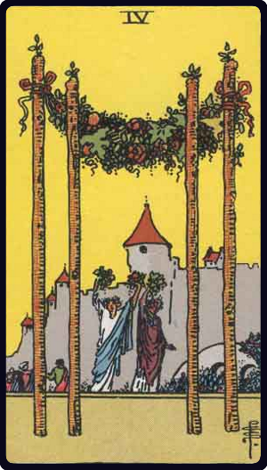

# Quatro de Paus

*Four of Wands*

## Waite — descrição e simbolismo

From the four great staves planted in the foreground there is a great garland suspended; two female figures uplift nosegays; at their side is a bridge over a moat, leading to an old manorial house.

## Waite — significados

They are for once almost on the surface— country life, haven of refuge, a species of domestic harvest-home, repose, concord, harmony, prosperity, peace, and the perfected work of these.

## Waite — invertida

The meaning remains unaltered; it is prosperity, increase, felicity, beauty, embellishment.

## Waite — resumo

Contrarieties. Reversed: Presentiment.

---

*Fontes: A. E. Waite, The Pictorial Key to the Tarot (1911), domínio público.*
