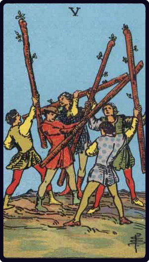

# Cinco de Paus

*Five of Wands*

## Waite — descrição e simbolismo

A posse of youths, who are brandishing staves, as if in sport or strife. It is mimic warfare, and hereto correspond the

## Waite — significados

Imitation, as, for example, sham fight, but also the strenuous competition and struggle of the search after riches and fortune. In this sense it connects with the battle of life. Hence some attributions say that it is a card of gold, gain, opulence.

## Waite — invertida

Litigation, disputes, trickery, contradiction.

## Waite — resumo

Generally favourable; a happy marriage; also patrimony, legacies, gifts, success in enterprise. Reversed: Return of some relative who has not been seen for long.

---

*Fontes: A. E. Waite, The Pictorial Key to the Tarot (1911), domínio público.*
