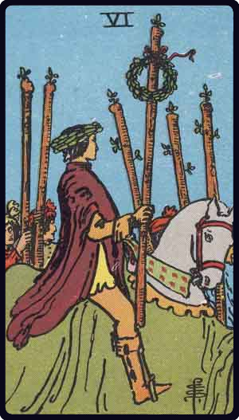

# Seis de Paus

*Six of Wands*

## Waite — descrição e simbolismo

A laurelled horseman bears one staff adorned with a laurel crown; footmen with staves are at his side.

## Waite — significados

The card has been so designed that it can cover several significations; on the surface, it is a victor triumphing, but it is also great news, such as might be carried in state by the King's courier; it is expectation crowned with its own desire, the crown of hope, and so forth.

## Waite — invertida

Apprehension, fear, as of a victorious enemy at the gate; treachery, disloyalty, as of gates being opened to the enemy; also indefinite delay.

## Waite — resumo

Servants may lose the confidence of their masters; a young lady may be betrayed by a friend. Reversed : Fulfilment of deferred hope.

---

*Fontes: A. E. Waite, The Pictorial Key to the Tarot (1911), domínio público.*
