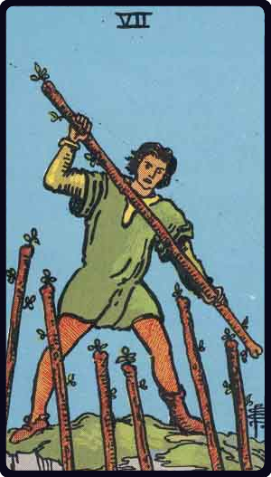

# Sete de Paus

*Seven of Wands*

## Waite — descrição e simbolismo

A young man on a craggy eminence brandishing a staff; six other staves are raised towards him from below.

## Waite — significados

It is a card of valour, for, on the surface, six are attacking one, who has, however, the vantage position. On the intellectual plane, it signifies discussion, wordy strife; in business— negotiations, war of trade, barter, competition. It is further a card of success, for the combatant is on the top and his enemies may be unable to reach him.

## Waite — invertida

Perplexity, embarrassments, anxiety. It is also a caution against indecision.

## Waite — resumo

Fair child; idea, design, resolve, movement. Reversed : Success, if accompanied by the Three of Cups. 57v.-Pleasant memories. Reversed: Inheritance to fall in quickly.

---

*Fontes: A. E. Waite, The Pictorial Key to the Tarot (1911), domínio público.*
