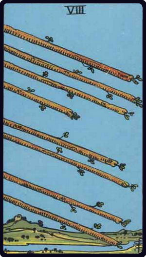

# Oito de Paus

*Eight of Wands*

## Waite — descrição e simbolismo

The card represents motion through the immovable-a flight of wands through an open country; but they draw to the term of their course. That which they signify is at hand; it may be even on the threshold. Divincitory Meanings: Activity in undertakings, the path of such activity, swiftness, as that of an express messenger; great haste, great hope, speed towards an end which promises assured felicity; generally, that which is on the move; also the arrows of love.

## Waite — invertida

Arrows of jealousy, internal dispute, stingings of conscience, quarrels; and domestic disputes for persons who are married.

## Waite — resumo

Marriage with a fair woman. Reversed: Perfect satisfaction.

---

*Fontes: A. E. Waite, The Pictorial Key to the Tarot (1911), domínio público.*
