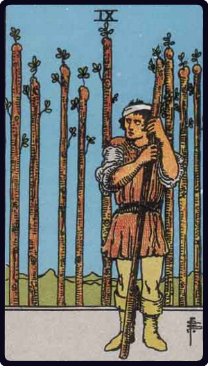

# Nove de Paus

*Nine of Wands*

## Waite — descrição e simbolismo

The figure leans upon his staff and has an expectant look, as if awaiting an enemy. Behind are eight other staves— erect, in orderly disposition, like a palisade.

## Waite — significados

The card signifies strength in opposition. If attacked, the person will meet an onslaught boldly; and his build shews, that he may prove a formidable antagonist. With this main significance there are all its possible adjuncts— delay, suspension, adjournment.

## Waite — invertida

Obstacles, adversity, calamity.

## Waite — resumo

Of good augury for military men. Reversed: Good business. 3.4 Some Additional Meanings of the Lesser Arcana

---

*Fontes: A. E. Waite, The Pictorial Key to the Tarot (1911), domínio público.*
