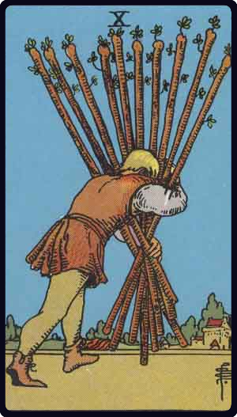

# Dez de Paus

*Ten of Wands*

## Waite — descrição e simbolismo

A man oppressed by the weight of the ten staves which he is carrying.

## Waite — significados

A card of many significances, and some of the readings cannot be harmonized. I set aside that which connects it with honour and good faith. The chief meaning is oppression simply, but it is also fortune, gain, any kind of success, and then it is the oppression of these things. It is also a card of false-seeming, disguise, perfidy. The place which the figure is approaching may suffer from the rods that he carries. Success is stultified if the Nine of Swords follows, and if it is a question of a lawsuit, there will be certain loss.

## Waite — invertida

Contrarieties, difficulties, intrigues, and their analogies.

## Waite — resumo

For a male Querent, a good marriage and one beyond his expectations. Reversed: Sorrow; also a serious quarrel.

---

*Fontes: A. E. Waite, The Pictorial Key to the Tarot (1911), domínio público.*
