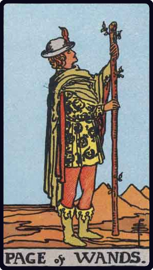

# Valete de Paus

*Page of Wands*

## Waite — descrição e simbolismo

In a scene similar to the former, a young man stands in the act of proclamation. He is unknown but faithful, and his tidings are strange.

## Waite — significados

Dark young man, faithful, a lover, an envoy, a postman. Beside a man, he will bear favourable testimony concerning him. A dangerous rival, if followed by the Page of Cups. Has the chief qualities of his suit. He may signify family intelligence.

## Waite — invertida

Anecdotes, announcements, evil news. Also indecision and the instability which accompanies it.

## Waite — resumo

Good augury; also a young man who is unfortunate in love. Reversed: Obstacles of all kinds.

---

*Fontes: A. E. Waite, The Pictorial Key to the Tarot (1911), domínio público.*
