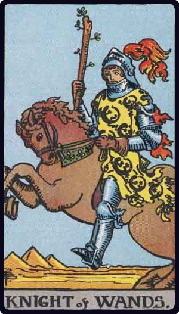

# Cavaleiro de Paus

*Knight of Wands*

## Waite — descrição e simbolismo

He is shewn as if upon a journey, armed with a short wand, and although mailed is not on a warlike errand. He is passing mounds or pyramids. The motion of the horse is a key to the character of its rider, and suggests the precipitate mood, or things connected therewith.

## Waite — significados

Departure, absence, flight, emigration. A dark young man, friendly. Change of residence.

## Waite — invertida

Rupture, division, interruption, discord,

## Waite — resumo

A visit from a friend, who will bring unexpected money to the Querent. Reversed: Irregularity.

---

*Fontes: A. E. Waite, The Pictorial Key to the Tarot (1911), domínio público.*
