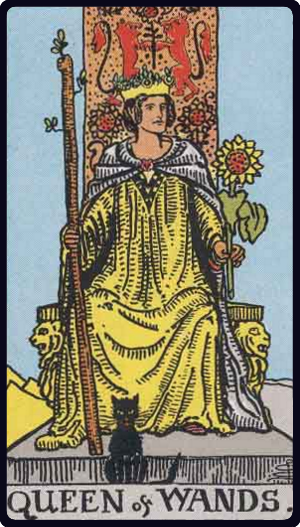

# Rainha de Paus

*Queen of Wands*

## Waite — descrição e simbolismo

The Wands throughout this suit are always in leaf, as it is a suit of life and animation. Emotionally and otherwise, the Queen's personality corresponds to that of the King, but is more magnetic.

## Waite — significados

A dark woman, countrywoman, friendly, chaste, loving, honourable. If the card beside her signifies a man, she is well disposed towards him; if a woman, she is interested in the Querent. Also, love of money, or a certain success in business.

## Waite — invertida

Good, economical, obliging, serviceable. Signifies also— but in certain positions and in the neighbourhood of other cards tending in such directions— opposition, jealousy, even deceit and infidelity.

## Waite — resumo

Sometimes denotes a woman of equivocal character. Reversed: A rich marriage for a man and a distinguished one for a woman.

---

*Fontes: A. E. Waite, The Pictorial Key to the Tarot (1911), domínio público.*
