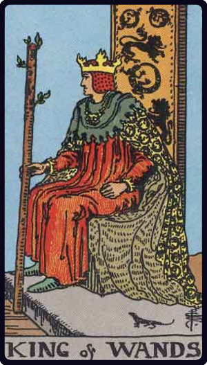

# Rei de Paus

*King of Wands*

## Waite — descrição e simbolismo

The physical and emotional nature to which this card is attributed is dark, ardent, lithe, animated, impassioned, noble. The King uplifts a flowering wand, and wears, like his three correspondences in the remaining suits, what is called a cap of maintenance beneath his crown. He connects with the symbol of the lion, which is emblazoned on the back of his throne.

## Waite — significados

Dark man, friendly, countryman, generally married, honest and conscientious. The card always signifies honesty, and may mean news concerning an unexpected heritage to fall in before very long.

## Waite — invertida

Good, but severe; austere, yet tolerant.

## Waite — resumo

Beware of ill-will on the part of a man of position, and of hypocrisy pretending to help. Reversed: Loss.

---

*Fontes: A. E. Waite, The Pictorial Key to the Tarot (1911), domínio público.*
